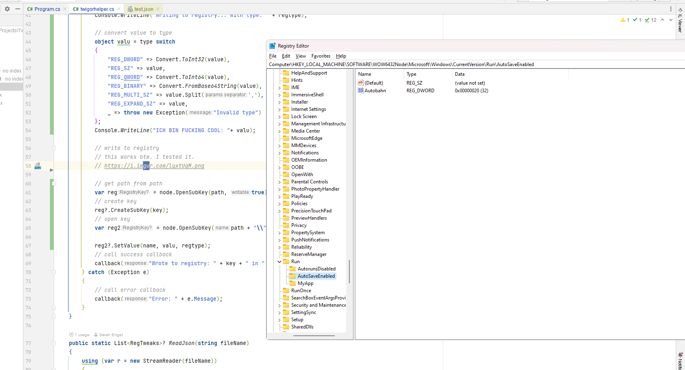

# Tweigor

Tweigor, short TweakingIntegrator, is a tool to automatically apply Regedits from json files.

### Success (2023-05-01)

#### We can now write into any path in the Registry and specify said data type

## Todo

- [x] Parse json
- [x] Figure out Registry Hive
- [ ] Make GUI
- [x] Make CLI
- [x] Make it work in general
- [ ] Make presets
- [ ] cleanup code

