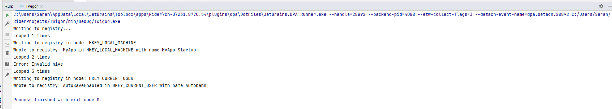

# Twigor-CS

Twigor-CS is a tool to automatically apply Regedits from json files.

## Todo

- [x] Parse json
- [x] Figure out Registry Hive
- [ ] Make GUI
- [ ] Make CLI
- [ ] Make it work in general

